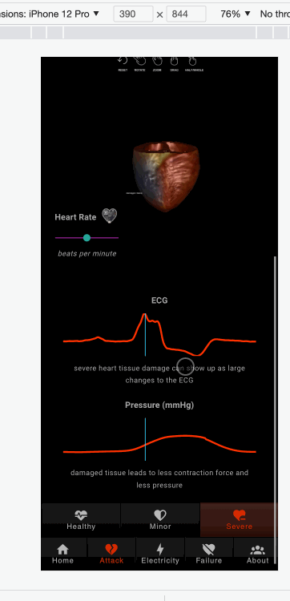
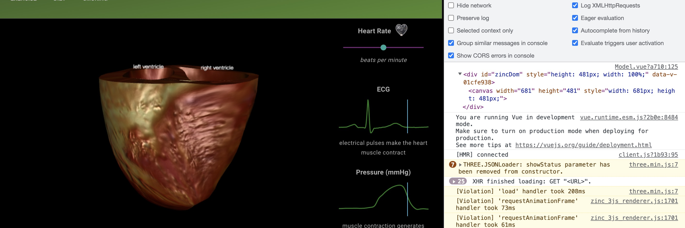
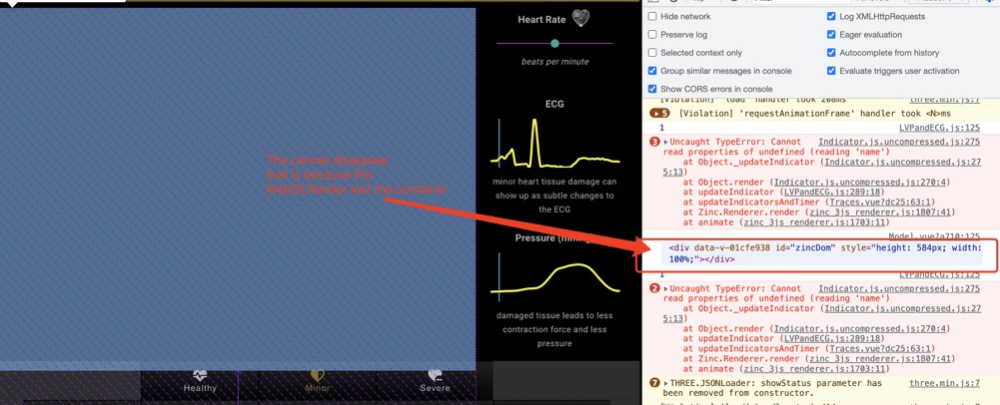
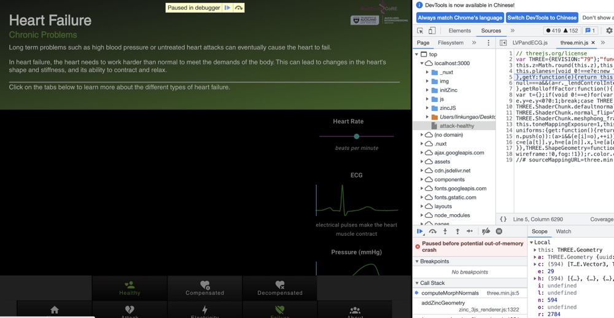

# issues&solutions

## Refresh issue

Description:
Every time when user switch to other model, the page will refrash.



This issue will cause two problems.

1. Poor user experience (maybe)
   if the user just want see the different heart models, every time switch the model, it will be refreshed, then the user have to slide down again and again.
2. Cannot solve the model refrash issue. (this is a very big issue on initial design)
   Base on current page design we have two options:

   - Initial WebGL render in model page (we can use vuex to store the WebGL render, then send to other page)
   - Initial WebGL render in Global (Becasue in the other componenet we also need to use WebGL render)

   Both of options meet a same issue, that is WebGL render needs a HTMLElement as container. Every time we switch the model, the model page will refresh to get the new data, then the container HTMLElement will be recreated, so the last container will be destoryed. This caused the WebGL render cannot find the new container HTMLElement, so it cannot to render the next model.
   This is the first time load the model screenshot:
   
   As you can see here everything works good here:

   - we initialed the WebGL render (only create one WebGL render in a 3D web app)
     ```
     render = new Zinc.Renderer(renderDom, window);
     ```
   - add the container to the WebGL render successfully.
   - load the model successfully.

   But when we switch to next model, the page will refreshed, and everything will be recreated, so our WebGL render will lost the container.
   

However, you maybe feel confused here, why we can switch the model successfully in before examples. That is because the WebGL render be initialed in the model page. That means everytime we switch the model, the page will be refreshed, and the WebGL render also will be recreated, so it will not lost the container. **But**, this has a very very very big issue, that is **each refresh creates a new render, which consumes a huge amount of the computer's GPU, and, with each model using its own render, it is impossible to share the data.** More importantly, when you switch multiple times, the web app will be crashed,because of the huge memory consumption.

When the user switch the model multiple times (around 20 times, depends on his computer performance) the page crashed.


The key reason for these issues is the url data be designed send through the nuxt route, and there is no stable container for WebGL render, because every time we switch the topics the page will be refreshed and everything will be recreated.
